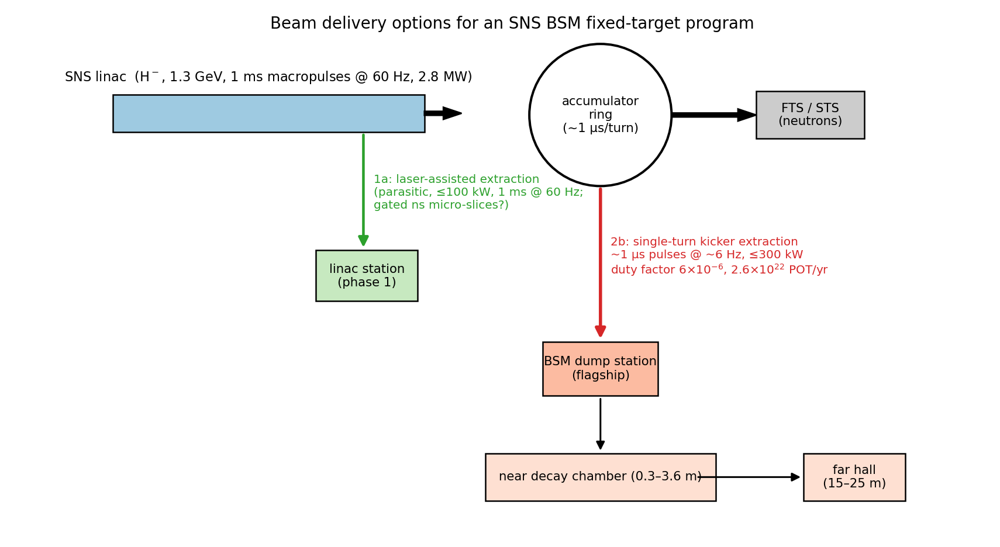
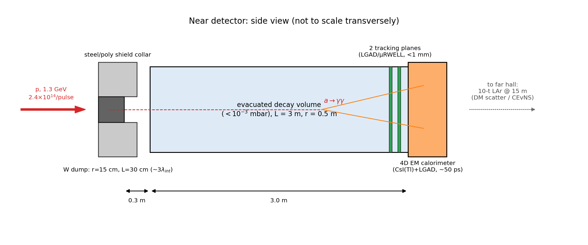

# Design Note: A BSM Fixed-Target Experiment at the SNS

*Draft v0.1 — companion to [`beam_time_structure_bsm.md`](beam_time_structure_bsm.md)
(beam options) and [`../study/`](../study/README.md) (sensitivity + Geant4 studies).*

## 1. Concept

A dedicated beam-dump station at the SNS, fed by single-turn kicker extraction
from the accumulator ring ("option 2b"): **1.3 GeV protons, ~1 µs pulses at
~6 Hz, up to 300 kW** (2.4×10¹⁴ p/pulse, 2.6×10²² POT/yr, duty factor
6×10⁻⁶). The station hosts two detectors matched to the two background-rejection
handles the beam provides (duty factor and time of flight):

- a **near decay-chamber spectrometer** (DAMSA-style) for short-lifetime
  dark-sector decays (benchmark: ALP → γγ), and
- a **far-hall scattering detector** (CCM/COHERENT-class LAr) for
  vector-portal dark matter, CEvNS-based BSM probes, and long-lifetime ALPs.

A parasitic **linac station** via laser-assisted (laser-stripping) extraction
(≤100 kW, phase 1) provides early beam for prototyping — and, if the stripping
laser can be gated at the 402.5 MHz micro-bunch level, ns-scale micro-slices
that make the near-chamber background strategy fully time-of-flight based.

## 2. Beam and source

| Parameter | Value |
|---|---|
| Proton kinetic energy | 1.3 GeV (√s ≈ 2.44 GeV; π production, no kaons) |
| Pulse width / rate | ~700 ns (one ring turn) @ ~6 Hz |
| Power / intensity | ≤300 kW; 1.4×10¹⁵ p/s; 2.4×10¹⁴ p/pulse |
| POT per year (5000 h) | 2.6×10²² |
| Duty factor | 6×10⁻⁶ (CCM-class; 10× better than present FTS) |
| Secondary source | π⁰: 0.13/POT → 0.26 γ/POT; π⁺/µ⁺ DAR: ~0.1 ν/flavor/POT |

## 3. Production target / dump

Compact tungsten cylinder, **r = 15 cm, L = 30 cm (~3 λ_int)**, radiatively
cooled or He-cooled (50 kJ/pulse, 300 kW average). Compactness is a physics
requirement: the a → γγ ceiling depends exponentially on the distance from the
production point (≈ shower maximum) to the decay volume. A steel/borated-poly
collar shields the transverse hall; the downstream face is deliberately thin.

## 4. Near detector (flagship: ALP → γγ)

| Element | Specification | Driver |
|---|---|---|
| Decay volume | 3 m long, r = 0.5 m, < 10⁻³ mbar vacuum | no beam-gas conversions; ALP decays in flight |
| Standoff | 0.3 m from dump exit | exponential ceiling sensitivity |
| Tracking | 2 stations (LGAD or µRWELL), < 1 mm point res. | γ conversion veto, vertex pointing |
| Calorimeter | 4D CsI(Tl) + LGAD readout, ~50 ps timing, 10×10 towers | diphoton mass, TOF, flash pile-up |
| Trigger window | beam-synchronous, prompt window only | 6×10⁻⁶ duty |

Signal: two photons from a common vertex in the vacuum volume, invariant mass
m_a, energy 30–700 MeV, in time with the beam (corrected for TOF). The
5-yr, 90% CL reach covers the **short-lifetime wedge m_a ≈ 30–300 MeV between
the E137/E141/CHARM ceiling and the FASER/PrimEx/BESIII floors**
(see `study/alp_limit_plot.png`), plus a strip near m_a ≈ 0.5–3 MeV below the
LEP floor.

## 5. Far hall

10-tonne-class LAr scintillation detector at 15–25 m, 20–30° off-axis
preferred (softer neutron field, identical DAR ν flux). Program: π⁰-portal
light dark matter (prompt window) with delayed-window CEvNS as the in-situ
flux normalization; NSI; inverse-Primakoff ALP scattering (long-lifetime
region, including the cosmological triangle); sterile-ν disappearance.

## 6. Backgrounds: Geant4 prompt-flash study

The zero-background assumption behind the sensitivity projections was tested
with a Geant4 (11.4, `Shielding` physics list) simulation of the bare dump:
all particles crossing the chamber entrance (0.6 m), calorimeter face (3.6 m),
and far hall (15 m) recorded per delta-pulse proton; beam time structure
applied by convolution. Results: `study/geant/README.md`.

Headlines (per 2.4×10¹⁴-proton pulse, E > 0.1 MeV):

| Plane | photons | neutrons | charged | n in 700 ns window | n earlier than γTOF+8 ns |
|---|---|---|---|---|---|
| chamber entrance (0.6 m) | 4.6×10¹³ | 6.7×10¹⁴ | 3.4×10¹³ | ~100% | — |
| calorimeter face (3.6 m) | 1.4×10¹² | 2.0×10¹³ | 6.8×10¹² | 90% | 4.2% |
| far hall (15 m) | 2.7×10¹¹ | 4.1×10¹² | 1.9×10¹² | 25% | ~0 |

Three design-driving conclusions: (i) with the ~700 ns ring pulse, the
**far hall** is in the validated CCM/COHERENT regime (most neutrons arrive
out-of-window and TOF-late; standard shielding suffices); (ii) the **near
chamber cannot run zero-background against a bare dump at 700 ns** — the
in-window flash at the calorimeter is ~10¹³ particles per pulse; (iii) with
**ns micro-slices**, 96% of neutrons at 3.6 m arrive after the photon signal
window, cutting the in-window flash per micro-bunch by ~10⁷ before shielding
or reconstruction cuts. The near chamber is therefore baselined with a
dump-side shield plug, a sweeper dipole (≈7×10¹² charged punch-through per
pulse, median 570 MeV), and micro-sliced beam as its design operating mode.

Mitigation strategy, in order of leverage: (i) the in-pulse flash never
touches the *vacuum* volume — backgrounds must produce a reconstructed
two-photon vertex inside it, which neutrons entering the calorimeter do not;
(ii) ~50 ps calorimeter timing converts the 3.6 m flight path into an
n/γ discriminator for E_n ≲ 400 MeV; (iii) dump-side shielding plug and
chamber liner; (iv) ultimately, ns micro-slices from gated laser stripping
make signal-photon TOF windows fully background-free between slices.

## 7. Open questions / R&D

1. Laser-stripping gating: can the linac station deliver ns micro-slices, and
   at what extracted power? (Determines whether the near chamber runs at the
   linac or ring station.)
2. Kicker extraction at 6 Hz: real pulse shape and extraction gap; trade
   against FTS/STS availability.
3. Dump thermal design at 50 kJ/pulse with a thin downstream face.
4. In-pulse calorimeter occupancy (flash pile-up) with 4D readout — needs a
   full optical/digitization simulation.
5. GEANT-level optimization of the shield collar and chamber liner.
