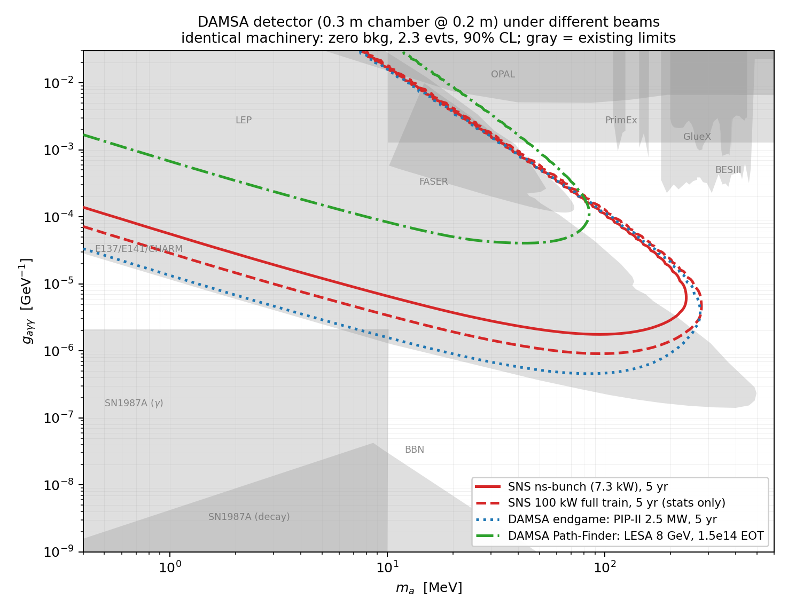

# Proposal: DAMSA at the SNS — a Table-Top Axion Search on a Laser-Stripped Beam-Dump Line

**Concept:** Install a DAMSA-class detector (sub-meter vacuum decay chamber,
two tracking planes, ~100-crystal CsI(Tl)+LGAD calorimeter) directly behind a
compact tungsten dump on a parasitic, laser-stripped beamline at the SNS
linac. Five years of running at **7.3 kW** — 0.3% of SNS beam power, taken
without disturbing the neutron program — probes axion-like particles in the
open region **m_a ≈ 30–220 MeV, g_aγγ ≈ 2×10⁻⁶–10⁻² GeV⁻¹**, covering the
short-lifetime wedge between the historic beam-dump exclusions and the
FASER/PrimEx/BESIII floors. The reach is within a factor ~4 in coupling of
DAMSA's own 2.5 MW endgame at a facility that does not yet exist — at 0.3%
of the beam power, available now.

## 1. The physics target

Decades of beam dumps (E137, E141, CHARM, NuCal) and collider/Primakoff
measurements (PrimEx, GlueX, BESIII, OPAL/LEP, FASER) bracket — but do not
close — a wedge of ALP parameter space at m_a ~ 30–300 MeV,
g_aγγ ~ 10⁻⁵–10⁻³ GeV⁻¹. It is open for a structural reason: at these
couplings the ALP decay length is centimeters to meters, too short to survive
the shielding of a conventional dump experiment ("the beam-dump ceiling") and
too feeble for colliders. Closing it requires a decay volume *centimeters from
production* — the DAMSA concept: an evacuated chamber where only new physics
can produce a displaced two-photon vertex, with invariant mass, dump-pointing,
and ~50 ps 4D calorimetry replacing passive shielding as the background
strategy. The same wedge hosts the QCD-axion-adjacent heavy-ALP bands invoked
in dark-sector cosmology; any signal is a discovery with a mass peak and a
reconstructible lifetime.

## 2. Why the SNS is the right host

| Parameter | Value | Why it matters |
|---|---|---|
| Proton energy | 1.3 GeV (post-PPU linac) | 0.13 π⁰/POT → 0.26 γ/POT; harder spectrum than any sub-GeV driver |
| Micro-bunch structure | 402.5 MHz, ~50 ps bunches, 5.9×10⁸ p | event-by-event TOF reference |
| Extraction | laser-assisted H⁻ stripping, gated: **1 bunch/µs sparse train** | 7.3 kW, parasitic; flash from each bunch clears before the next |
| Exposure | 6.4×10²⁰ POT/yr → 3.2×10²¹ POT in 5 yr | 8×10²⁰ photons on the Primakoff target |
| In-gate duty factor | 2×10⁻⁵ (0.4 ns gate/µs) | steady-state backgrounds negligible |

The decisive comparison is **photon flux and timing per dollar**. DAMSA's
pathfinder beams are parasitic electron lines rationed in watts (SLAC LESA:
200 W, 1.5×10¹⁴ EOT baseline); a 1.3 GeV proton delivers 0.26 hard photons
for 0.2 nJ, so even 7 kW of SNS beam supplies **~35,000× the LESA baseline
photon flux**, while the gated stripping laser provides ps-class production
timing that no accumulator-based facility can match. No kicker, no ring
hardware, no high-power target station: the beamline is an upgrade of the
existing SNS laser-stripping development program.

## 3. Sensitivity, on a controlled footing

Identical machinery (Primakoff production with Helm form factor + atomic
screening; thick-target conversion σ_P/σ_abs; decay-in-flight acceptance;
50% diphoton efficiency; zero background, 2.3 events at 90% CL) applied to
the same detector under four beams:

| Beam | Exposure | g floor @ 100 MeV | mass reach |
|---|---|---|---|
| **SNS sparse ns-bunch, 7.3 kW, 5 yr (this proposal)** | 3.2×10²¹ POT | **1.8×10⁻⁶ GeV⁻¹** | 221 MeV |
| SNS 100 kW full train (upgrade path, stats only) | 4.5×10²² POT | 9.4×10⁻⁷ | 258 MeV |
| DAMSA endgame: PIP-II 2.5 MW (unbuilt) | 1.4×10²⁴ POT | 4.8×10⁻⁷ | 258 MeV |
| DAMSA Path-Finder: LESA baseline | 1.5×10¹⁴ EOT | no coverage | ~80 MeV, high-g only |

440× less POT than the PIP-II endgame costs only ~4× in coupling floor
(zero-background limits scale as POT^¼; 1.3 GeV vs 1 GeV adds 1.6× in π⁰
yield), while the high-coupling ceiling — set by geometry, not statistics —
is essentially identical.

## 4. Why the projection is trustworthy

**The signal model is conservative.** Only π⁰-decay photons are counted (EM
shower and bremsstrahlung photons ignored); π⁰ emission is taken isotropic
(forward peaking would help a downstream detector); the π⁰ yield (0.13/POT)
is anchored to the COHERENT/STS flux studies at this exact beam energy; the
Primakoff cross section is the standard form with nuclear form factor and
atomic screening; efficiency is a flat 50%.

**The zero-background assumption is simulated, not asserted.** A full Geant4
(11.4, `Shielding` physics list, HP neutron transport) study of this exact
geometry — 10 cm W dump, 10 cm (30 X₀) W plug, chamber and calorimeter
planes — was used first to *reject* configurations that fail (a bare dump
with the ring's 700 ns pulse is hopeless: ~10¹³ in-window particles per
pulse), and then to validate this one. The budget per 0.4 ns TOF gate:
**zero prompt in-gate hits in 10⁵ simulated protons even before the plug**;
the inter-bunch glow is 11 photons/gate but with a hard nuclear
(giant-dipole) endpoint at ~25 MeV — *below the 30 MeV cluster threshold* —
plus 0.75 Michel e±/gate (charged-vetoed) and 65 invisible neutrinos. Net:
≤26 accidental pairs in 5 yr *before* topology cuts (an MC-statistics upper
limit), **~8×10⁻⁴ expected events after the fiducial-vertex and mass
requirements alone**. The three load-bearing design elements are explicit:
the 30 MeV per-cluster threshold, the front-tracker charged veto, and the
30 X₀ plug. Every candidate event additionally carries its own ps-level TOF
verification against the 402.5 MHz bunch clock.

**The beam numbers are SNS parameters, not aspirations:** 1.3 GeV/38 mA peak
(PPU values), the demonstrated 402.5 MHz micro-bunch structure, and the
laser-stripping technique already developed at the SNS. The single
accelerator R&D item is gating the stripping laser to select isolated
micro-bunches — a laser-timing problem, not a new machine.

## 5. Cost posture and asks

Detector: table-top (vacuum tank <1 m, two LGAD/µRWELL planes, ~100 CsI(Tl)
crystals + fast readout) — university-group scale, and identical to hardware
the DAMSA collaboration is already prototyping. Beamline: gated stripping
laser + transport to a small shielded enclosure with a compact dump.
**Asks:** (1) accelerator-physics study of gated laser stripping (sparse
micro-bunch extraction at ≥10⁻⁴ stripping efficiency); (2) siting study for a
~3×3 m enclosure at the linac dump line; (3) high-statistics biased Geant4
run of prompt punch-through (the one budget entry still limited by MC
statistics); (4) engagement with the DAMSA collaboration — this is their
detector on a beam that advances their endgame physics a decade early.

---
*Supporting material in this repository: beam-structure analysis
(`beam_time_structure_bsm.md`), RF/timing options (`rf_structure_options.md`),
sensitivity machinery (`../study/`), Geant4 background validation
(`../study/geant/`), detector comparison (`damsa_at_sns.md`).*
