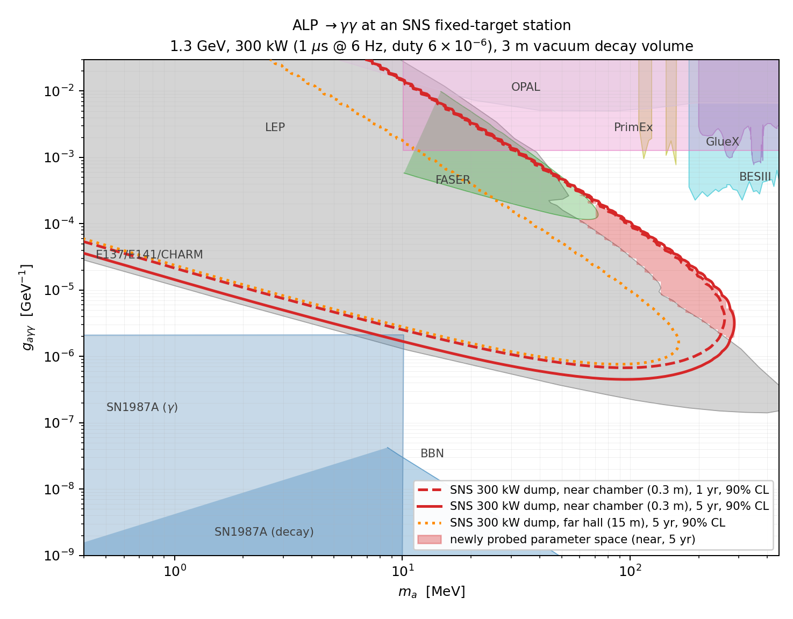

# ALP Sensitivity Study: SNS BSM Fixed-Target Station

First-pass sensitivity study for the flagship benchmark identified in
[`docs/beam_time_structure_bsm.md`](../docs/beam_time_structure_bsm.md):
axion-like particles with a photon coupling, Primakoff-produced in a tungsten
dump by the "option 2b" beam (1.3 GeV, 300 kW, ~1 µs pulses at ~6 Hz,
duty factor 6×10⁻⁶) and detected via a → γγ decays in an evacuated decay volume.

Run `python3 alp_sensitivity.py` (numpy + matplotlib) to reproduce
`alp_limit_plot.png`.

## Signal model

1. **Photon source:** π⁰ production at 0.13/POT (≈ π⁺ yield at 1.3 GeV from
   COHERENT/STS flux studies), kinetic spectrum dN/dT ∝ T·exp(−T/80 MeV)
   truncated at 600 MeV, isotropic; π⁰ → γγ decayed by Monte Carlo
   (0.26 photons/POT, spectrum extending to ~700 MeV).
2. **Primakoff conversion** γZ → aZ on tungsten: standard differential cross
   section with Helm nuclear form factor and Tsai atomic screening, integrated
   numerically; thick-target conversion probability σ_P/σ_abs with
   σ_abs = 35 b (pair-production-dominated attenuation, λ = 9/7 X₀).
3. **Decay in flight:** Γ(a→γγ) = g²m³/64π;
   P = exp(−L₁/d) − exp(−(L₁+L₂)/d) with d the lab-frame decay length.
4. **Detector configurations** (3 m vacuum decay volume, 50% diphoton
   efficiency, E_a > 30 MeV):
   - **near** (DAMSA-style): decay chamber entrance 0.3 m behind the
     production point in a compact dump; 0.5 m aperture radius.
   - **far** (CCM-style hall): entrance at 15 m, 1 m aperture radius.
5. **Statistics:** zero-background, 90% CL ⇔ 2.3 signal events.
   POT: 2.6×10²² /yr (300 kW, 5000 h).

## Result

90% CL sensitivity band (near chamber, 5 yr = 1.3×10²³ POT):

| m_a | g range probed [GeV⁻¹] | existing ceiling |
|-----|------------------------|------------------|
| 1 MeV | 1.6×10⁻⁵ – 3×10⁻² | LEP floor 8×10⁻⁴ |
| 10 MeV | 1.7×10⁻⁶ – 1.3×10⁻² | within E137/E141 + FASER |
| 50 MeV | 5.5×10⁻⁷ – 4.5×10⁻⁴ | dump ceiling ~10⁻⁴ |
| 100 MeV | 4.9×10⁻⁷ – 8.9×10⁻⁵ | dump ceiling 4.4×10⁻⁵ |
| 200 MeV | 7.1×10⁻⁷ – 1.8×10⁻⁵ | dump ceiling 5.5×10⁻⁶ |
| ≥300 MeV | — (photon flux too soft) | |

**Newly probed territory** (red shading in the plot): the short-lifetime wedge
m ≈ 30–300 MeV between the E137/E141/CHARM ceiling and the FASER / PrimEx /
GlueX / BESIII floors — exactly the DAMSA-motivated region, reachable only
because the decay volume sits ~0.3 m from production — plus a strip around
m ≈ 0.5–3 MeV up to the LEP floor. The far hall (15 m) mostly re-probes the
E137 band with an orthogonal technique and a robust zero-background
configuration; the near chamber is what buys discovery space.

## Caveats / next steps

- **Backgrounds at 0.3 m from a 300 kW dump with 1 µs pulses are the open
  question.** DAMSA assumes ns-scale pulses; the in-pulse flash here is ~10⁵×
  longer. This directly motivates the laser-stripped ns micro-slice option
  flagged in the beam-structure note — at the linac station, a gated stripping
  laser could provide DAMSA-grade timing at reduced power. **A Geant4 study of
  the prompt flash is now in [`geant/`](geant/README.md)**: it confirms the
  bare-dump 700 ns configuration is not zero-background at 0.3 m, and
  quantifies the ~10⁷ in-window suppression available from ns micro-slices.
- NA64 visible-decay and NuCal recasts (not in the overlay set) cover part of
  the band at m ≲ 100 MeV, g ~ 10⁻⁴–10⁻²; the high-mass wedge survives.
- Only π⁰ decay photons are included (no EM-shower photons, no proton
  bremsstrahlung): conservative, mostly at low mass.
- Isotropic π⁰ approximation; forward peaking at 1.3 GeV would help a
  downstream detector.
- Other channels at the same facility (not yet computed): inverse-Primakoff
  scattering in a LAr detector (reaches the long-lifetime "cosmological
  triangle"), vector-portal dark matter via π⁰ → γA′, ALP-electron couplings.

Existing limits: digitized data from
[cajohare/AxionLimits](https://github.com/cajohare/AxionLimits) (CC-BY).
