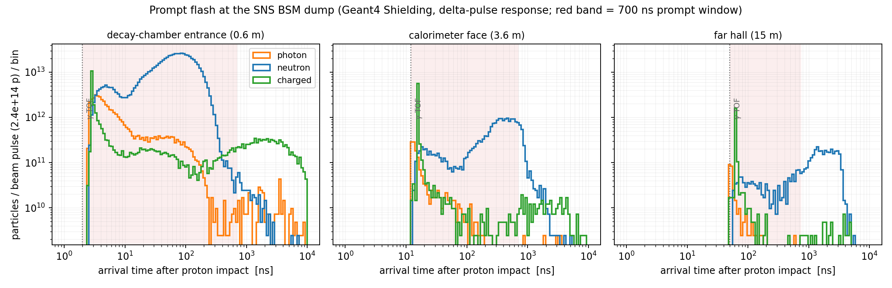
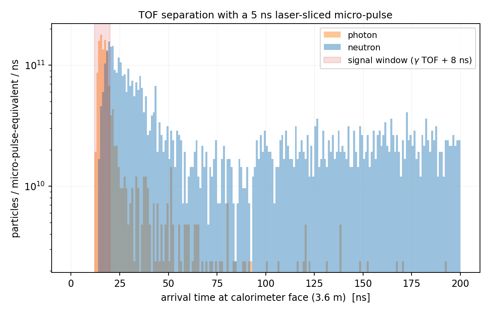

# Geant4 Prompt-Flash Study

Quantifies the beam-related background environment at the near decay chamber
and far hall of the proposed SNS BSM dump station, testing the
zero-background assumption used in the [ALP sensitivity study](../README.md).

## Setup

- **Geant4 11.4.1**, `Shielding` reference physics list (HP neutron transport,
  G4NDL 4.7.1), conda-forge build.
- Geometry (`flash.cc`): 1.3 GeV proton pencil beam on a **bare** compact
  tungsten dump (r = 15 cm, L = 30 cm ≈ 3 λ_int) in an air hall — i.e. the
  worst case, no shielding at all. Matches the ALP-study near configuration.
- Scoring: every particle (E > 0.1 MeV) crossing, in the +z direction:
  - plane 0: z = 0.6 m, r < 0.5 m — decay-chamber entrance;
  - plane 1: z = 3.6 m, r < 0.5 m — calorimeter face;
  - plane 2: z = 15 m, r < 1.0 m — far-hall detector.
- 10⁵ primaries (delta pulse at t = 0); beam pulse shapes applied by
  convolution in `analyze_flash.py`. Tracks killed at t > 10 µs; neutrons
  killed below 100 keV.

Build/run:

```bash
micromamba run -p /opt/g4env cmake .. && make    # in build/
micromamba run -p /opt/g4env ./flash 100000
python3 analyze_flash.py
```

## Results

Per beam pulse of 2.4×10¹⁴ protons (option 2b full power), particles crossing
each plane; "in window" = arriving within the ~700 ns pulse, i.e.
indistinguishable from signal by timing at that pulse width:

| Plane | photons / pulse | neutrons / pulse | charged / pulse | median E_n | n arriving < γTOF+8 ns |
|---|---|---|---|---|---|
| chamber entrance (0.6 m) | 4.6×10¹³ | 6.7×10¹⁴ | 3.4×10¹³ | 0.48 MeV | — |
| calorimeter face (3.6 m) | 1.4×10¹² | 2.0×10¹³ (90% in window) | 6.8×10¹² | 0.54 MeV | **4.2%** |
| far hall (15 m) | 2.7×10¹¹ | 4.1×10¹² (25% in window) | 1.9×10¹² | 0.60 MeV | ~0 |





## Interpretation

1. **A bare dump + 700 ns pulse does not support the near-detector
   zero-background assumption.** ~10¹⁴-scale neutrons and ~10¹³ photons
   sweep the chamber aperture inside the prompt window every pulse. The
   vacuum volume itself is inert, but the calorimeter face sees ~3×10¹³
   particles per pulse — far beyond any in-window exclusive reconstruction.
2. **Time of flight is the strongest single handle, and it requires a short
   pulse.** At 3.6 m, 96% of neutrons arrive later than the photon flight
   time + 8 ns (they are mostly few-MeV evaporation neutrons, β ~ 0.05; the
   4% early tail is the >200 MeV spallation component). With the ~700 ns
   option-2b pulse this ordering is washed out; with a **ns-scale
   micro-slice** (gated laser stripping at the linac station) the signal
   window cleanly precedes the bulk of the flash (second figure). Per
   402.5 MHz micro-bunch (~6×10⁸ p), the in-signal-window neutron crossing
   count drops to ~2×10⁶ over the full calorimeter face — a ~10⁷ reduction
   before any shielding, vertexing, or kinematic cuts.
3. **The far hall works as advertised with the 700 ns pulse.** Only 25% of
   neutrons arrive in-window at 15 m and the field is 160× weaker than at the
   chamber entrance; with the standard tens-of-cm steel/poly monolith
   (not simulated here) plus the 6×10⁻⁶ duty factor, this is the
   CCM/COHERENT operating regime, validated by those experiments.
4. **Charged punch-through (median ~570 MeV forward protons/pions, ~7×10¹²
   per pulse at 3.6 m) motivates a sweeper dipole** between dump and chamber,
   plus the tracker front veto.

Design consequences adopted in `docs/experiment_design.md`: shield plug and
sweeper for the near line; the near chamber's flagship operation pairs
naturally with ns micro-slices (linac station) while the 700 ns ring pulses
drive the far-hall program.

## Caveats

- No shielding, building, or floor in the geometry: prompt fluxes through the
  planes are conservative (high), but room-return/albedo neutrons — relevant
  at late times — are underestimated.
- Neutrons below 100 keV and times beyond 10 µs are truncated (capture-γ
  backgrounds between pulses not addressed; the 167 ms inter-pulse gap and
  duty factor handle these).
- Delta-pulse convolution assumes a rectangular beam pulse.
- Statistics: 10⁵ primaries → few-% precision at the far plane.
